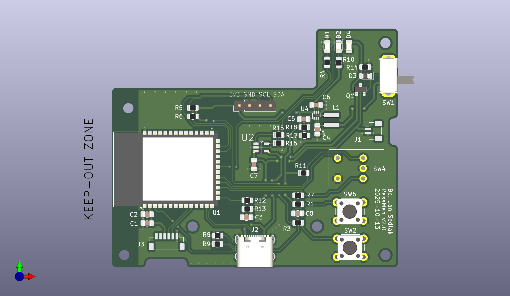

# Passman
I am developing embedded password manager with a desktop app as a part of my master thesis.  

- Author: bc. Jan Sedlak
- Supervisor: Ing. Ondřej Nentvich, Ph.D.
- Uni & faculty: CTU, faculty of electrical engeneering
- Field: Technology of the Internet of Things
- Department: Radioelectronics

## First prototype

## Repo overview

    /_docs - All used or useful documents
    /SW - Firmware and desktop application files
    /HW - PCB and enclosure files

